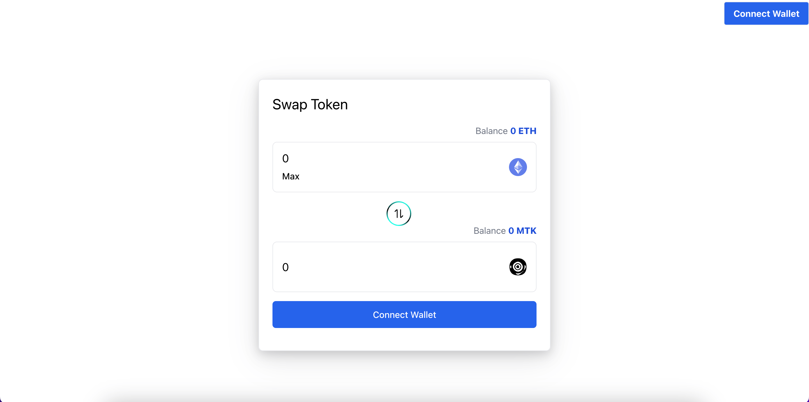

# ERC20 Token Swap (Testnet)

## Preview

## Overview

ERC20 Token Swap is a Web3 decentralized application that allows users to swap ERC-20 tokens with ETH on the Ethereum Sepolia testnet. The project was built as a hands-on experiment to practice wallet integration, on-chain interactions, and token swap flows in a safe, non-production environment.

## Features

- Swap ERC20 tokens <-> ETH
- Supports Ethereum Sepolia testnet only

## Tech Stack

- **Next.js**
- **TypeScript**
- **Wagmi**
- **Viem**
- **Ethereum (Sepolia Testnet)**

## Supported Network

- Ethereum Sepolia Testnet

## Purpose

This project was created as a personal learning project to explore ERC-20 token mechanics, wallet connectivity, and transaction handling in a Web3 frontend application.
